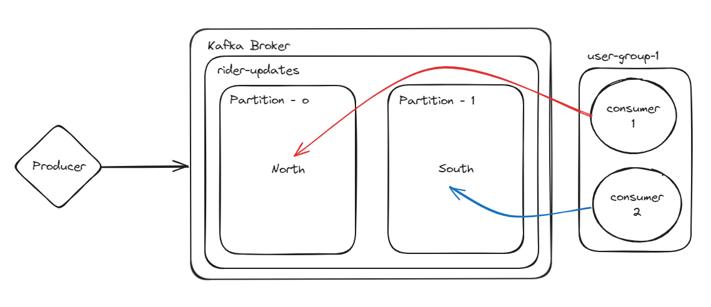

# Kafka Example Project

This project demonstrates the basic usage of Apache Kafka with `kafkajs` in a Node.js environment. The project includes an admin script to create Kafka topics, a producer to send messages, and a consumer to receive messages.

## Prerequisites

-   Node.js
-   Docker
-   Apache Kafka
-   Yarn

## Installation

1. **Clone the repository**

    ```bash
    git clone https://github.com/VivekChaurasia03/DoKafka.git
    cd DoKafka
    ```

2. **Install dependencies**

    ```bash
    yarn install
    ```

## Configuration

Update the Kafka broker address in `client.js` if it's different from `<PRIVATE_IP>:9092`.

```javascript
const kafka = new Kafka({
    clientId: "my-app",
    brokers: ["your-kafka-broker-address:9092"],
});
```

## Setup Kafka

Before you start the admin, make sure to run the following commands to set up Zookeeper and Kafka using Docker.

1. **Start Zookeeper Container and expose PORT 2181**

    ```bash
    docker run -p 2181:2181 zookeeper
    ```

2. **Start Kafka Container, expose PORT 9092 and set up ENV variables**

    ```bash
    docker run -p 9092:9092 \
    -e KAFKA_ZOOKEEPER_CONNECT=<PRIVATE_IP>:2181 \
    -e KAFKA_ADVERTISED_LISTENERS=PLAINTEXT://<PRIVATE_IP>:9092 \
    -e KAFKA_OFFSETS_TOPIC_REPLICATION_FACTOR=1 \
    confluentinc/cp-kafka
    ```

## Usage

### Admin

Use the admin script to create topics in your Kafka cluster.

```bash
node admin.js
```

### Producer

Run the producer script to send messages to the Kafka topic. It takes input from the console.

```bash
node producer.js
```

Enter the rider name and location separated by a space, for example:

```bash
John north
```

### Consumer

Run the consumer script to consume messages from the Kafka topic. Provide a group ID as an argument.

```bash
node consumer.js my-group
```

## Files

-   **`client.js`**: Creates and exports a Kafka client instance.
-   **`admin.js`**: Contains the script to create the Kafka topic `rider-updates`.
-   **`producer.js`**: Contains the script to send messages to the `rider-updates` topic.
-   **`consumer.js`**: Contains the script to consume messages from the `rider-updates` topic.

## Snapshots for better understanding

### One Consumer One Group


### Two Consumer One Group



### Two Consumer Groups


